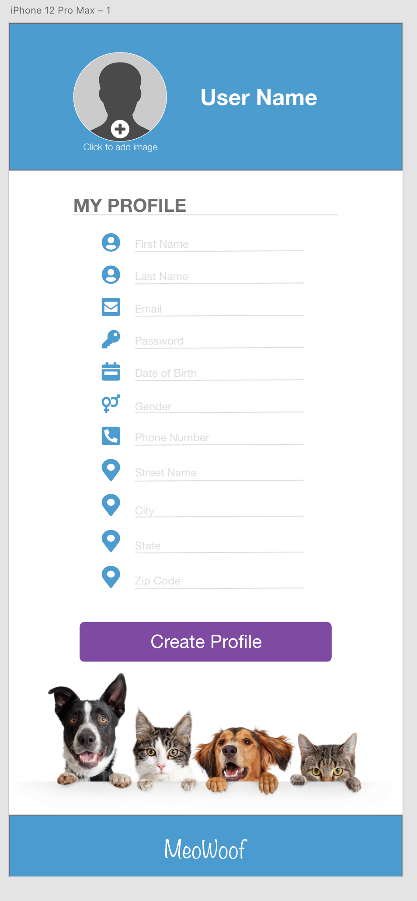

# MeoWoof

  
  
  
  

  ## Table of Contents 
  * [Description](#Description)
  * [Project URL](#Project-URL)
  * [Mock-up](#Mock-up)
  * [Usage](#Usage)
  * [Credits](#Credits)
  * [License](#License)
  * [Features](#Features)
  * [Tests](#Tests)
  * [Resources](#Resources)
  * [Contact](#Contact)
  * [Designed and built by](#Designed-and-built-by)
  #
  
  ## Description 
   The MeoWoof is a mobile first designed application featuring a map and display the route walked for the day with date & time stamp, and distance/ duration walked. This feature will also display in real time so that the owner may see if/ where their dog sitter/ helper is walking their furball in real time!

  ## Project URL
  https://github.com/johnsonr84/meowoof

  ## Mock-Ups
  <table>
  <tr>
    <td>MeoWoof App Login Page</td>
     <td>MeoWoof Sign Up Page</td>
     <td>MeoWoof Dashboard</td>
     <td>MeoWoof Walk History</td>
  </tr>
  <tr>
    <td></td>
    <td></td>
    <td></td>
    <td></td>
  </tr>
 </table>

  ## Installation 
  No installations required at this time 

  ## Usage 
   
  ## Credits 
  Rob Johnson, Aubry Mark, Sergio Campos, Trae McNabb  

  ## License 
  This project is [mit](https://choosealicense.com/licenses/mit/) licensed.

  ## Features
  Coming soon maybe!

  ## Tests
  No tests required at this time 

  ## Resources
    

  * [Inquirer](https://www.npmjs.com/package/inquirer) 
  * [GitHub Mastering Markdown](https://guides.github.com/features/mastering-markdown/)
  * [Choose a License](https://choosealicense.com/)
  * [Badmath](https://img.shields.io/github/languages/top/nielsenjared/badmath)
  * [shields.io](https://shields.io/)
  * [w3schools](https://www.w3schools.com/)
  * [stackoverflow.com](https://stackoverflow.com/)
  * [01-HTML-Git-CSS/04-Important/Good-README-Guide/README.md]

  ## Contact
  Email: robertcjohnson1984@gmail.com 

  ## Designed and built by
  Author(s): 
  * Rob Johnson (https://github.com/johnsonr84/) 
  * Aubry Mark (https://github.com/Aubsma)
  * Sergio Campos (https://github.com/surge3216)
  * Trae McNabb  (https://github.com/trae1357)

  